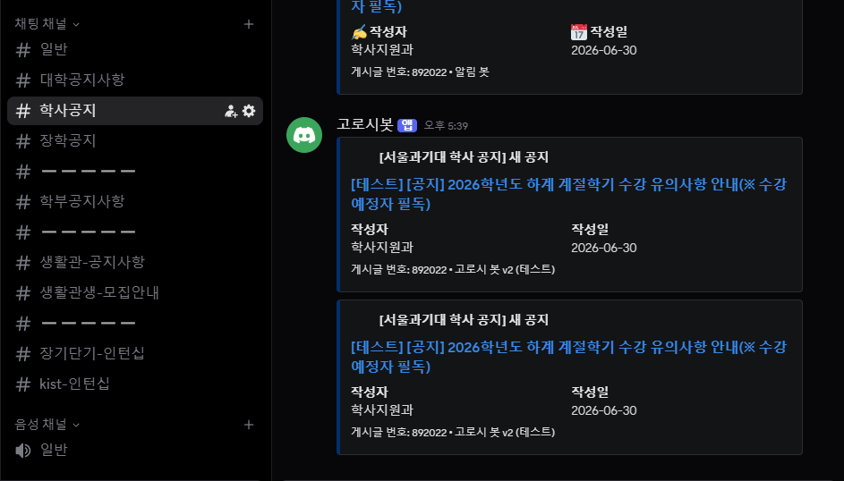

# 고로시 봇 v2 (Gorosi Bot)

대학교의 주요 공지사항을 수집하여 디스코드로 자동 전송하는 알림 봇입니다.  
기존 공무원 및 날씨 알림 용도로 사용하던 봇을 대학 공지사항 전용으로 전면 개편했습니다.

## 제작 배경
- 학사, 장학, 학과, 생활관, 인턴십 등 분산된 공지사항을 한 곳에서 모니터링하기 위해 제작했습니다.
- 주요 공지를 놓치지 않도록 접근성이 좋은 디스코드 알림을 활용했습니다.
- 기존 Heroku 환경에서 유지보수가 용이한 Github Actions 환경으로 시스템을 이전했습니다.

## 주요 기능
- **다중 게시판 크롤링**: 일반 공지, 학사 공지, 생활관(공지 및 신청 내역), 일반/KIST 인턴십(로그인 기반) 등 다양한 게시판을 모니터링합니다.
- **안전한 새 글 감지 및 전송**: 디스코드 메시지 전송에 최종 성공한 게시글 번호만 `data/bidx.json`에 동기화하여, 일시적인 네트워크 순단 등에 의한 알림 유실을 원천 차단합니다.
- **실시간 장애 모니터링**: 웹사이트 구조 변경 등으로 크롤링 오류 발생 시, 설정된 관리자 채널(`ADMIN_CHANNEL_ID`)로 상세 에러 내용과 Traceback Embed를 즉각 발송합니다.
- **자동화 및 스케줄링**: 외부 크론 서비스(`cron-job.org`)와 GitHub Actions API(`workflow_dispatch`) 연동을 통해 한국 시간 평일(월~금) 09:00 ~ 18:00 사이에 매 시간 정각마다 지연 및 누락 없이 안정적으로 작동합니다.
- **안정성 및 속도 최적화**: 15초 HTTP 타임아웃 탑재, GitHub Actions `pip` 캐시 적용 및 동시성 제어(`concurrency`) 설정을 통해 리소스 낭비와 충돌을 최소화했습니다.
- **객체지향(OOP) 구조**: 크롤러 모듈들이 추상화되어 있어 다른 게시판 추가 시 확장이 매우 용이합니다.

## 프로젝트 구조
- `src/main.py`: 봇 메인 실행 파일(진입점)
- `src/bot.py`: 디스코드 클라이언트 접속 및 임베드 발송, 장애 대응 알림 처리
- `src/config.py`: 모니터링 채널 목록, 에러 알림 어드민 채널 및 환경 변수 설정
- `src/crawlers/`: 각 웹사이트에 맞춘 공지사항 크롤링 클래스들 (`seoultech.py`, `housing.py`, `internship.py` 등)
- `data/bidx.json`: 각 게시판별 최근 전송 완료된 게시글 번호 동기화 데이터
- `.github/workflows/gorosi_bot_v2.yml`: 외부 크론 서비스로부터 요청을 받아 봇을 구동하며 빌드 및 상태 커밋을 수행하는 워크플로우

## 운영 및 실행 환경
- **호스팅**: GitHub Actions (Public Repository)
- **스케줄러**: [cron-job.org](https://cron-job.org/) (외부 무료 크론 서비스)
- **연동 방식**: GitHub Personal Access Token (Fine-grained PAT)을 활용하여 매시간 API(`workflow_dispatch`)를 호출해 강제 기동하는 방식
- **외부 크론 도입 이유**:
  - **정시 실행 보장**: GitHub Actions 내장 스케줄러(`on: schedule`)는 무료 계정 기준 작업 분배 서버의 부하 상태에 따라 몇 분에서 최대 3시간까지 실행이 지연되거나, 부하가 매우 극심할 때는 실행 자체가 큐에서 통째로 누락(Drop)됩니다. (특히 KST 오전 09:00 ~ 11:00 사이의 실행 누락 현상이 두드러짐)
  - **비활성화 정책 우회**: GitHub의 정책상 레포지토리에 사람의 직접적인 활동(커밋 등)이 60일간 없으면 워크플로우 스케줄러가 자동으로 정지됩니다. 외부 크론을 이용해 API로 강제 기동하는 방식은 이 비활성화 조건에 영향을 받지 않아 장기 안정 운영이 가능합니다.
