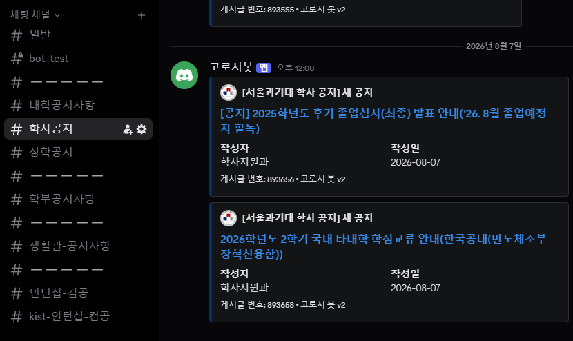
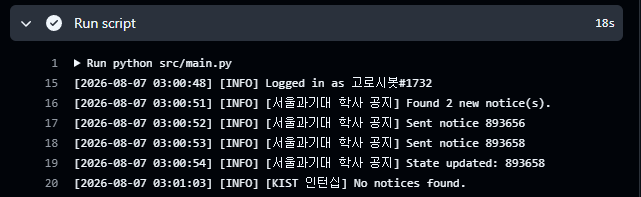

# 고로시 봇 v2 (Gorosi Bot)

> 서울과기대 주요 공지사항(학사·장학·컴퓨터공학과·생활관·인턴십)을 크롤링하여 디스코드 채널로 자동 전송하는 봇입니다.

| 디스코드 알림 예시 | 실행 로그 |
| :---: | :---: |
|  |  |

## 제작 배경 및 v1 대비 변경 사항
- **용도 개편**: 기존 공무원 시험 및 날씨 알림 봇에서 대학 공지사항 전용 알림 봇으로 전면 개편
- **운영 환경 이전**: Heroku 서버 환경에서 무료 운영 및 유지보수가 용이한 GitHub Actions 환경으로 이전
- **모니터링 강화**: 단순 수집을 넘어 전공 키워드 필터링, 전송 성공 상태 동기화(`bidx.json`), 관리자 장애 알림 기능 추가

## 주요 기능
- **수집 대상 게시판**: 서울과기대 일반/학사/장학 공지, 컴퓨터공학과 공지, 생활관 공지, 현장실습/KIST 인턴십 공지
- **전공 키워드 필터링**: 인턴십 공지 중 설정된 전공 키워드(컴퓨터, 소프트웨어, 인공지능 등)가 포함된 게시글만 선별
- **전송 상태 동기화**: 디스코드 메시지 전송 성공 시에만 해당 게시글 번호를 `data/bidx.json`에 저장하여 중복 전송 및 알림 유실 방지
- **실시간 장애 알림**: 크롤링 실패 또는 HTTP 오류 발생 시 관리자 채널(`ADMIN_CHANNEL_ID`)로 상세 Traceback 전송
- **로그 및 테스트 모드**:
  - **로그 기록**: 콘솔 출력 및 파일 저장(`logs/bot.log`, 5MB 단위 순환 보관)으로 실행 이력 관리
  - **안전한 테스트 기능**: `TEST_CHANNEL_ID` 환경변수 지정 시 테스트 채널로 수신 대상이 변경되며, 상태 파일(`bidx.json`) 수정을 건너뛰어 안전하게 테스트 가능

## 프로젝트 구조
```text
gorosi-bot/
├── .github/workflows/
│   └── gorosi_bot_v2.yml   # 봇 구동 및 상태 자동 커밋 워크플로우
├── assets/                  # README 첨부 이미지
├── data/
│   └── bidx.json           # 최근 전송 완료된 게시글 번호 동기화 파일
├── src/
│   ├── crawlers/           # 게시판별 크롤링 모듈 (SeoulTech, Housing, Internship)
│   ├── bot.py              # 디스코드 메시지 전송 및 장애 알림 처리
│   ├── config.py           # 크롤링 대상 목록, 디스코드 채널 및 키워드 설정
│   └── main.py             # 메인 실행 파일 (진입점)
└── README.md
```

## 운영 및 구동 방식
- **구동 일정**: 한국 시간 기준 평일(월~금) 09:00 ~ 18:00 사이 매시 정각 실행
- **호스팅**: GitHub Actions
- **스케줄러**: [cron-job.org](https://cron-job.org/) (`workflow_dispatch` API 호출)
- **외부 크론 사용 이유**:
  - **지연 방지**: GitHub Actions 기본 스케줄러(`on: schedule`)의 실행 지연(최대 수 시간) 및 큐 누락 현상 방지
  - **자동 정지 방지**: 60일간 커밋 등 리포지토리 활동이 없을 때 워크플로우가 자동 비활성화되는 GitHub 정책 방지
